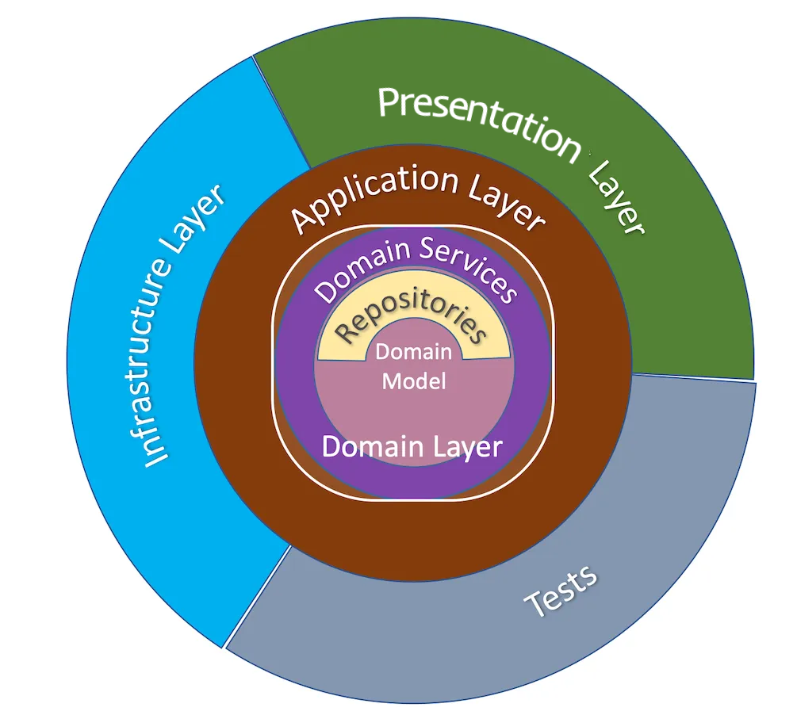

# Project Setup
<!-- Author: @sglbl -->
### Installing `uv` project manager

Ensure you have [`uv`](https://sglbl.notion.site/UV-149a7f36b84480b0b4f4f074883bcd42) installed on your system. If not, install it using the following command:

```bash
curl -LsSf https://astral.sh/uv/install.sh | sh
```

### Managing the Virtual Environment

Create the **python3.10** `.venv` virtual environment with this command on the project root directory.

```bash
uv venv --python 3.10.12
```

Activate the virtual environment.
```bash
# You can activate the virtual environment with the following command.
source .venv/bin/activate

# You can deactivate the virtual environment with the following command.
deactivate
```
> Next time the project workstation is opened, these commands can be used to activate/deactivate the virtual environment.

### Setting Up the Project Environment

Once `uv` is installed and environment is activated, use this to set up the project dependencies:

```bash
uv sync
```

#### Other Requirements
Put the secret tokens, keys, etc. in `.env` file in root directory. (Check the example in [`.env.example`](data/example_inputs/.env.example) file)

### Running the Application


```bash
python -m src.main
python -m src.main_api
```

---
### Generate Html Docs
```bash
pdoc3 --html -o data/_app_docs/ src --force
```

**Note:** Docs will compile the written Google Docstring for the classes and functions.

---
### Full Structure 


```diff
.
@@─ pyproject.toml                      # All project details and python dependencies. (Created by uv) @@
├── README.md                           # Project overview and instructions for use.
├── data                                # Directory for data-related files.
│   ├── docs                            # Documentation files related to data.
│   ├── images                          # Directory for storing image assets.
│   ├── ml_models                       # Directory for storing LLMs and ML models.
│   └── processed                       # Directory for processed data outputs.
├── docker                              # Docker-related configurations and scripts.
│   ├── x.Dockerfile                    # Dockerfile for building the project's container for x.
│   ├── docker-build.sh                 # Shell script to automate Docker builds.
│   └── docker-compose.yml              # Defining multi-container Docker applications.
!── src                                 # Source code using onion architecture (Dependency goes inwards)
│   ├── main_api.py                     # Entry point for the API layer of the application.  
│   ├── main_ui.py                      # Entry point for the UI layer of the application.  
+   ├── application                     # Contains high-level application logic.  
│   │   ├── x_services/                 # Service layer for LLM-related operations.  
│   │   ├── service_interfaces/         # Interface for abstraction of services.
│   │   └── utils.py                    # Helper functions for the app.  
+   ├── domain                          # Contains core business logic and domain models.  
│   │   ├── models                      # Directory for domain-specific data models.  
│   │   │   └── data_models.py          # Business logic / domain data models with data classes.  
│   │   └── repository_interfaces       # Interfaces for repository patterns.  
│   │       └── y_repository.py         # Interface for some external operations.  
+   ├── infra                           # Infrastructure code, particularly for database handling.  
│   │   ├── database                    # Database-related configurations and utilities.  
│   │   │   └── db_create.py            # Script to initialize and create database schema.  
│   │   └── repository_implementations  # Implementations of repository interfaces.  
│   │       └── y_repository.py         # Implementation of repository.  
+   └── presentation                    # Presentation layer like APIs and UIs.  
│       ├── dependencies.py             # Dependencies for presentation layer (API token checks, etc.).  
│       ├── rest                        # API-related presentation logic.  
│       │   ├── routers                 # API route definitions.  
│       │   │   └── items.py            # Routes related to item operations.  
│       │   ├── schemas.py              # Data validation and serialization schemas.  
│       │   └── serve_api.py            # Code to serve the API, possibly using FastAPI or Flask.  
│       └── ui                          # UI-related presentation logic.  
│           ├── asset.py                # CSS & JS functions needed for UI.  
│           └── gradio_ui.py            # UI Implementation.  
├── tests                               # Directory for test cases and configurations.  
│   ├── conftest.py                     # Test fixtures and setup configurations.  
│   └── test_api.py                     # Test cases for API endpoints.  
```
